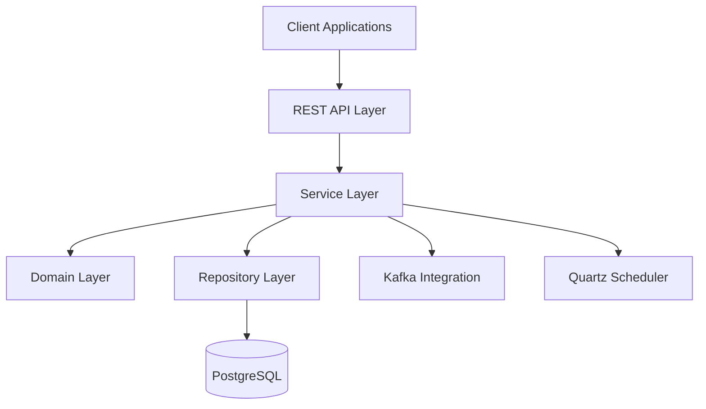
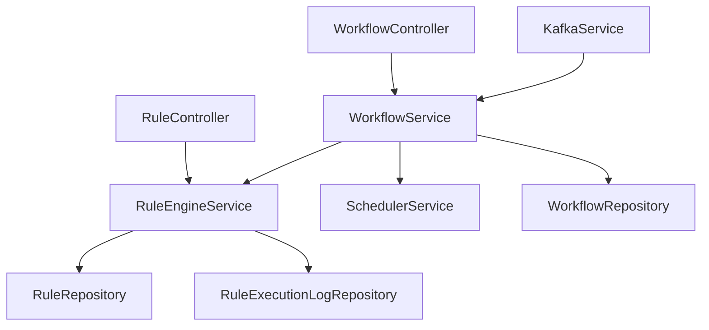

# System Patterns

## Architecture Overview

### High-Level Architecture

### Component Relationships

## Design Patterns

### Service Layer
- Service interfaces and implementations
- Dependency injection using constructor injection
- Transaction management using @Transactional
- Exception handling and logging

### Repository Pattern
- JPA repositories for data access
- Custom query methods
- Entity relationships and mappings
- Transaction management

### Event-Driven Architecture
- Kafka message producers and consumers
- Event-based workflow execution
- Asynchronous processing
- Message serialization/deserialization

### Scheduler Pattern
- Quartz job scheduling
- Cron-based execution
- Job persistence
- Error handling and retry

### Rule Engine Pattern
- Rule evaluation using SpEL
- Rule chaining and composition
- Rule result tracking
- Rule validation

## Technical Decisions

### Framework Choices
1. Spring Boot 3.2.3
   - REST API support
   - Dependency injection
   - Transaction management
   - Security framework

2. PostgreSQL
   - Relational database
   - ACID compliance
   - JSON support
   - Performance optimization

3. Kafka
   - Event messaging
   - Message persistence
   - Scalability
   - Fault tolerance

4. Quartz
   - Job scheduling
   - Cron expressions
   - Job persistence
   - Clustering support

### Design Principles
1. SOLID Principles
   - Single Responsibility
   - Open/Closed
   - Liskov Substitution
   - Interface Segregation
   - Dependency Inversion

2. Clean Architecture
   - Domain-driven design
   - Separation of concerns
   - Dependency rules
   - Testability

3. REST API Design
   - Resource-oriented
   - Stateless
   - Cacheable
   - Uniform interface

## Component Details

### Rule Engine
- Rule definition and validation
- Rule execution and chaining
- Result tracking and logging
- Error handling

### Workflow Engine
- Step definition and ordering
- Rule orchestration
- State management
- Error recovery

### Kafka Integration
- Message serialization
- Error handling
- Retry mechanisms
- Dead letter queues

### Scheduler
- Job definition
- Cron expressions
- Job persistence
- Error handling

## Security Patterns
- Authentication (to be implemented)
- Authorization (to be implemented)
- API security (to be implemented)
- Data encryption (to be implemented)

## Monitoring Patterns
- Logging (to be implemented)
- Metrics (to be implemented)
- Tracing (to be implemented)
- Alerting (to be implemented)

## Error Handling
- Global exception handling
- Retry mechanism for Kafka messages
- Circuit breaker for external services
- Fallback strategies
- Comprehensive error logging

## Testing Strategy
- Unit tests for rules and services
- Integration tests for workflows
- Kafka message testing
- Performance testing
- Security testing

## Deployment Architecture
- Docker containerization
- Kubernetes orchestration
- Load balancing
- Database replication
- Message queue clustering

## Notes
- This document focuses on technical implementation patterns
- Updates should reflect architectural decisions and their rationale
- All patterns should align with project requirements and constraints 